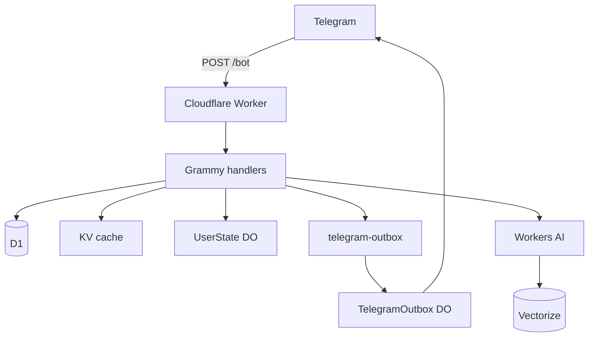

# Nekonymous

**Nekonymous** / **نِکونیموس** is a Persian-first anonymous Telegram bot: personal deep-link messaging, a conversation-style **assessment** (ارزیابی), and opt-in anonymous **matching**.

The UI is Telegram only. A single Cloudflare Worker handles the webhook, storage, crypto, assessment, and matching — there is no public website or SPA in V1.

---

## What it does

### 1. Anonymous relay

1. User runs `/start` and gets a personal `t.me/Bot?start={slug}` link.
2. Someone opens the link and sends a message (text or supported media).
3. The owner reads pending messages with `/inbox`.
4. The owner can reply anonymously, block/report, pause incoming messages, or set a private nickname per sender.

### 2. Assessment (ارزیابی سبک گفت‌وگو)

- **56 Likert questions** across **14 dimensions** (version **`v1`**).
- Non-clinical; result is private to the user.
- Stored as structured scores in D1 (`assessment_profiles`) and a controlled summary for Vectorize.
- Active progress lives in `UserStateDO` (`assessment_sessions`).

### 3. Anonymous matching (opt-in)

- User completes assessment, then enables discoverability.
- Vectorize finds semantic candidates; deterministic scoring ranks them.
- Requester sends an encrypted intro; **candidate must accept** before a normal inbox ticket is created.

Nekonymous is **not** a dating app, social network, clinical tool, or E2EE messenger.

---

## Bot surface

### Main menu

```text
🔗 لینک من
🧭 مچ‌یابی
⚙️ تنظیمات
```

### Match hub (🧭 مچ‌یابی)

```text
👤 پروفایل من
🔎 پیدا کردن مچ
📥 درخواست‌های در انتظار
📝 شروع ارزیابی / 📝 ارزیابی دوباره
↩️ مچ‌یابی
```

### Settings (⚙️ تنظیمات)

Includes display name, pause/resume inbox, unblock all, reset match history, about/privacy, technical notes, and **🗑️ پاک کردن حساب** (full account wipe + new link).

### Commands

```text
/start
/inbox
/settings
/assessment
/match
/match_system
```

---

## Architecture



| Layer | Technology | Role |
|--------|------------|------|
| Entry | Cloudflare Worker | Webhook only (`POST /bot`) |
| Bot | Grammy | Commands, messages, callbacks |
| Relational data | D1 | Users, links, assessment, matching, anonymous stats |
| Hot per-user state | UserState DO (SQLite) | Inbox, drafts, blocks, labels, assessment session |
| Routing cache | KV | `tg:{hash}`, `link:{slug}` |
| Async Telegram | Queue + Outbox DO | Idempotent non-critical sends |
| Semantic search | Workers AI + Vectorize | Profile embeddings, candidate discovery |
| Crypto | Web Crypto | HMAC, HKDF, AES-256-GCM |

### Design principles

- Minimize plaintext at rest; encrypt message payloads and chat ids.
- Clear message payloads from DO after `/inbox` delivery.
- KV is cache only — never authority for inbox or profiles.
- Vectorize narrows candidates; final ranking is deterministic code.
- Matching is opt-in; discoverability defaults to off.
- Account reset **hard-deletes** user-linked D1 rows; only anonymous aggregate counters remain.

---

## Storage map

| Data | Where |
|------|--------|
| User identity, encrypted chat id | D1 `users` |
| Public slug | D1 `public_links` + KV `link:{slug}` |
| Conversation counts (no body) | D1 `conversations` |
| Assessment profile & attempts | D1 `assessment_*` |
| Match requests, suggestions, blocks | D1 `match_*` |
| Anonymous lifetime stats | D1 `platform_stats` (no user ids) |
| Inbox tickets, drafts, blocks, labels | UserState DO |
| Assessment session progress | UserState DO `assessment_sessions` |
| Vector embeddings | Vectorize (`profile:{userId}:v1`) |

---

## D1 schema (V1)

Migrations: `0001_init.sql`, `0002_platform_stats.sql`.

**Core:** `users`, `public_links`, `conversations`, `reports`, `consents`

**Assessment:** `assessment_profiles`, `assessment_attempts`, `assessment_answers`, `profile_vector_index_events`

**Matching:** `match_suggestions`, `match_requests`, `match_blocks`, `match_events`

**Stats:** `platform_stats` — single row with `messages_relayed`, `assessment_completions`, `match_requests` (incremented on events; survives account deletion)

D1 never stores plaintext message bodies, raw Telegram ids, or raw assessment answers in profile summaries shown to others.

---

## Account reset (پاک کردن حساب)

On confirm, `clearUserAccountAndRecreate`:

1. Purges the user's Durable Object (inbox, drafts, blocks, assessment session, …).
2. Hard-deletes all D1 rows for that user (assessment, matches, conversations, links, user row).
3. Deletes Vectorize vector and KV routing keys.
4. Creates a **new** internal user id and public link.

`platform_stats` lifetime counters are **not** tied to the user and are not rolled back.

---

## Matching pipeline

```text
Requester (discoverable, indexed profile)
  → Vectorize topK (metadata: discoverable, locale, safetyTier, profileVersion=v1)
  → merge bounded discoverable D1 profiles (sparse-index fallback)
  → load assessment_profiles for pool
  → deterministic score + safety filters
  → top 5 suggestions
  → intro → encrypted match_request → candidate accept/decline
  → on accept: normal inbox ticket
```

---

## Crypto (summary)

| Secret | Purpose |
|--------|---------|
| `APP_MASTER_KEY` | Payload/chat id/nickname encryption |
| `APP_HMAC_PEPPER` | `telegram_user_hash` (no raw Telegram id in D1) |
| `BOT_SECRET_KEY` | Webhook `X-Telegram-Bot-Api-Secret-Token` |

Per-message ticket keys derived via HKDF from `ticket_id`. Ciphertext envelope: `{ v, kid, iv, ct }` (AES-256-GCM).

---

## Project layout

```text
src/
├── index.ts
├── bot/                    # Grammy wiring, menus, keyboards, router
├── features/
│   ├── identity/           # users, links, hard delete
│   ├── messaging/          # relay, inbox, reports
│   ├── settings/
│   ├── assessment/         # v1 questionnaire + profile + vectors
│   ├── matching/
│   └── platform/           # platform_stats
├── storage/                # UserState + Outbox DOs and clients
├── queues/
├── crypto/
├── i18n/
└── utils/

migrations/
tools/                      # verify-*, flush-remote.*
```

See [AGENTS.md](./AGENTS.md) for agent/coding rules and detailed handler map.

---

## Local development

### Requirements

- Node.js 22+
- pnpm
- Cloudflare account (Workers, D1, KV, DO, Queues, AI, Vectorize)
- Telegram bot token

### Install & secrets

```bash
pnpm install
cp .env.example .dev.vars   # fill secrets locally; never commit
```

### Run

```bash
pnpm dev                    # wrangler dev --local --port 8787
pnpm db:migrations:apply:local
```

### Checks

```bash
pnpm check                  # typecheck + lint + knip + test:crypto + test:assessment + test:matching
```

### Deploy

```bash
pnpm deploy                 # remote D1 migrations + wrangler deploy --minify
```

---

## Wrangler bindings

Configured in `wrangler.jsonc`:

- `DB` → D1 `nekonymous_core`
- `NEKO_KV`
- `USER_STATE_DO`, `TELEGRAM_OUTBOX_DO`
- `TELEGRAM_OUTBOX_QUEUE`
- `AI`, `PROFILE_VECTORS`

Production secrets via `wrangler secret put` (see `.env.example` and AGENTS.md).

---

## Destructive reset (ops)

Full environment wipe (D1 + KV + Vectorize recreate):

```bash
./tools/flush-remote.sh           # remote
./tools/flush-remote.sh --local   # also local D1/KV
```

Does **not** clear Durable Object state per user; users may need `/start` again after a flush.

---

## Telegram webhook

```bash
curl -X POST "https://api.telegram.org/bot<TOKEN>/setWebhook" \
  -H "Content-Type: application/json" \
  -d '{
    "url": "https://nekonymous.mohetios.dev/bot",
    "secret_token": "<BOT_SECRET_KEY>",
    "allowed_updates": ["message", "callback_query"]
  }'
```

---

## Privacy notes

- Hosted anonymous **relay** — not end-to-end encryption.
- Telegram and the Worker see plaintext while processing; only ciphertext is stored.
- Full assessment results and raw answers are not shown to other users.
- Public “about” stats in the bot use anonymous `platform_stats` plus live counts (e.g. active users, current discoverable profiles).

---

## V1 scope

Included:

- Anonymous relay with encrypted inbox tickets
- Assessment v1 (56 / 14) + Vectorize indexing
- Opt-in matching with accept-gated intros
- Hard account deletion with aggregate stats retention

Explicitly out of scope for V1:

- Public HTML pages / marketing site in the Worker
- `/test` command or `test_*` schema (renamed to `assessment_*`)
- Legacy KV conversation storage
- Soft-deleted user accounts
