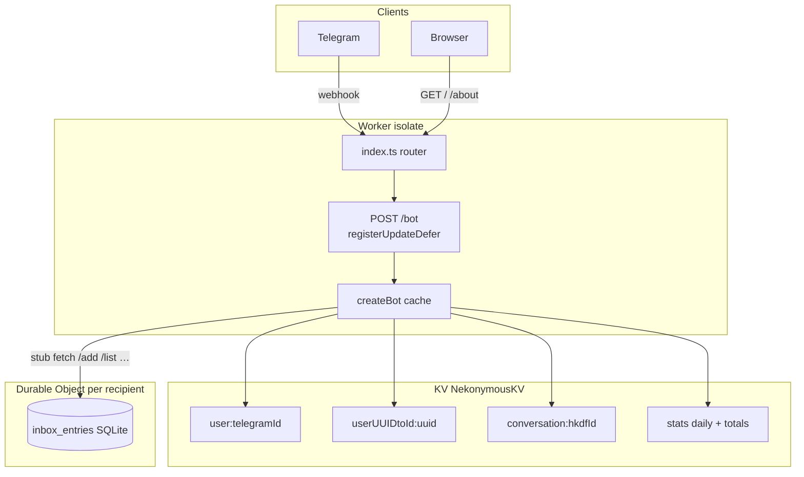

# Nekonymous

**Nekonymous** (نِکونیموس) is a Persian-first anonymous messaging bot for Telegram. Each user gets a personal link; anyone who opens it can send them a message without showing their Telegram username. Replies stay anonymous in both directions.

The app is a single [Cloudflare Worker](https://developers.cloudflare.com/workers/): signed Telegram webhook, encrypted KV storage, and one **SQLite Durable Object** inbox per recipient.

---

## Architecture

### Design principles

| Concern | Approach |
|---------|----------|
| Hot path | One Worker isolate; Grammy bot instance cached per isolate; HKDF key material cached per `APP_SECURE_KEY` |
| User state | KV JSON records (`user`, `userUUIDtoId`, `stats`) — eventually consistent, fine for profiles |
| Inbox ordering | **Durable Object per recipient** — serializes enqueue/deliver; not stored in KV |
| Message bodies | AES-256-GCM ciphertext in KV **and** copied into the DO until delivery (see lifecycle below) |
| Side effects | Homepage stats increments deferred with `ctx.waitUntil` so the webhook ACK stays fast |

### What runs where

| Layer | Technology | Role |
|-------|------------|------|
| HTTP edge | Cloudflare Worker (`src/index.ts`) | Router, webhook, static HTML, admin cleanup |
| Bot runtime | [Grammy](https://grammy.dev/) (`src/bot/`) | Commands, reply keyboards, inline callbacks |
| Profiles & ciphertext | Cloudflare **KV** | Users, UUID map, encrypted conversations, stats |
| Inbox queue | **`InboxSqliteDurableObject`** | One DO per recipient Telegram ID; SQLite `inbox_entries` |
| Crypto | Web Crypto API | HKDF-SHA-256 + AES-256-GCM (`src/utils/ticket.ts`) |



### HTTP surface

| Method | Path | Auth | Purpose |
|--------|------|------|---------|
| `GET` | `/` | — | Landing page; reads `stats:total:*` (lazy backfill from daily keys) |
| `GET` | `/about` | — | About / privacy (static HTML) |
| `GET` | `/about/technical` | — | Advanced architecture guide (Persian, for operators/devs) |
| `POST` | `/bot` | `X-Telegram-Bot-Api-Secret-Token: BOT_SECRET_KEY` | Telegram webhook |
| `POST` | `/admin/cleanup` | `Authorization: Bearer BOT_SECRET_KEY` | Ops: purge all inbox DOs + wipe KV namespaces |

### Webhook request path

1. `index.ts` parses `update_id`, registers a `waitUntil` defer for that update.
2. `createBot(env)` returns a cached Grammy instance (keyed by token + bot info + secure key).
3. Middleware attaches `ctx.deferWork` so handlers can call `scheduleWork()` for non-blocking KV stats writes.
4. Handler runs (`commands.ts`, `actions.ts`, `settings.ts`); Telegram gets the HTTP response.
5. Deferred promises (e.g. `incrementStat`) complete in the background.

---

## Storage

### KV namespaces (`KVModel` prefix)

| Key pattern | Type | Contents |
|-------------|------|----------|
| `user:{telegramId}` | JSON `User` | Display name, link UUID, `blockList`, `contactLabels`, `paused`, draft `currentConversation`, `pendingSettings` |
| `userUUIDtoId:{uuid}` | string | Shareable 22-char link token → owner Telegram ID |
| `conversation:{conversationId}` | opaque text | AES ciphertext (`saveText` / `getText` — never `JSON.parse`) |
| `stats:newUser:YYYY-MM-DD` | number | Daily new registrations |
| `stats:newConversation:YYYY-MM-DD` | number | Daily new anonymous sends |
| `stats:total:newUser` | number | Running total for homepage |
| `stats:total:newConversation` | number | Running total for homepage |

### Inbox Durable Object (`InboxSqliteDurableObject`)

- **Instance key:** `idFromName(recipientTelegramId)`
- **Storage:** SQLite table `inbox_entries` (schema v1 in `_sql_schema_migrations`)
- **Cap:** 50 rows total per inbox (`429` on `/add` when full)

| Column | Purpose |
|--------|---------|
| `ref` | 8 hex chars — Telegram inline callback handle (`rpl:`, `blk:`, `ubl:`, `nnk:`) |
| `ticket_id` | Random 256-bit ticket (base64url) — HKDF salt for this message |
| `conversation_id` | HKDF-derived KV key for the ciphertext blob |
| `ciphertext` | Copy of encrypted payload while **pending**; `NULL` after delivery |
| `delivered` | `0` = pending queue; `1` = delivered (ref kept for callbacks) |
| `created_at` | Insert order for FIFO delivery |

**DO routes** (via `src/utils/inbox.ts` stub):

| Method | Path | Response |
|--------|------|----------|
| `POST` | `/add` | `{ pendingCount }` or `429` if full |
| `GET` | `/list` | Pending entries with ciphertext only |
| `GET` | `/entry?ref=` | Single row (any delivery state) |
| `POST` | `/mark-delivered` | Clears `ciphertext`, sets `delivered = 1` |
| `DELETE` | `/purge` | Wipes SQL + `storage.deleteAll()` |

### Message ticket & encryption

Each anonymous message gets a fresh **ticket** (`generateTicketId`, 32 random bytes → base64url).

From one `encryptConversationPayload(ticketId, json, APP_SECURE_KEY)` call:

| Output | Derivation | Stored where |
|--------|------------|--------------|
| `conversationId` | HKDF info `nekonymous:conversation:v1` | KV key `conversation:{id}` |
| `ciphertext` | AES-256-GCM, wire `iv.ciphertext` (base64url) | KV + DO row until delivery |
| `ticketId` | Random opaque handle | DO row only |
| `ref` | 4 random bytes → 8 hex | DO row; inline keyboard callbacks |

**Sender alias** (nicknames): HKDF info `nekonymous:label:v1:{senderId}` with recipient-scoped salt → opaque key in `user.contactLabels`. Plain nickname text never goes into ciphertext or the DO.

**Anonymity:** Recipients do not see sender Telegram usernames. The operator can map UUIDs to Telegram IDs and decrypt with `APP_SECURE_KEY` — hosted relay, not E2E.

### Ciphertext lifecycle (dual store)

```
SEND
  KV  conversation:{id}  ← full ciphertext (connection + payload)
  DO  inbox_entries     ← copy of same ciphertext, delivered=0

/inbox DELIVER
  DO  decrypt from row ciphertext → Telegram
  KV  re-encrypt with empty payload (connection metadata only)
  DO  mark-delivered → ciphertext=NULL, delivered=1, ref kept

CALLBACK (reply / block / nickname)
  DO  /entry?ref= → ticketId + conversationId
  KV  getText(conversationId) → decrypt connection from KV
```

Callbacks after delivery always read **KV**, not DO ciphertext (already cleared). The DO row remains as a stable `ref` → `conversationId` index.

---

## Data flows

### 1. Owner registration (`/start` without payload)

1. `ensureUser` creates `user:{id}` + `userUUIDtoId:{uuid}` if missing.
2. Welcome message includes `buildUserDeepLink(userUUID)`.
3. `incrementStat(newUser)` scheduled via `waitUntil`.

### 2. Visitor opens link (`/start {uuid}`)

1. Validate link ID format (`isUserLinkId`, 20–24 char base64url).
2. Resolve owner: `userUUIDtoId.get(uuid)` → `user:{ownerId}`.
3. Checks: not self, not blocked, owner not `paused`.
4. Show compose prompt with `publicDisplayName(owner)` (reserved menu words → «کاربر»).
5. Set visitor `currentConversation.to = ownerId` in KV.

### 3. Send anonymous message

1. Visitor sends text/media while `currentConversation.to` is set.
2. Build `Conversation` JSON → `encryptConversationPayload`.
3. `conversationModel.saveText(conversationId, ciphertext)`.
4. `addInboxEntry` → DO `POST /add` (returns `pendingCount`).
5. On `429` inbox full: **delete** the KV conversation key (no orphan blob).
6. Confirm to sender; notify recipient with pending count.
7. Clear visitor draft; `incrementStat(newConversation)` deferred.

**Pause rule:** New sends via link respect `recipient.paused`. **Thread replies** (`reply_to_message_id` set from inbox **پاسخ**) bypass pause.

### 4. Read inbox (`/inbox`)

1. `GET /list` on recipient's DO — pending rows with ciphertext.
2. For each entry: decrypt DO ciphertext → `sendDecryptedMessage` (nickname header if set).
3. Notify sender «seen» (best-effort `sendMessage` to `connection.from`).
4. Re-encrypt KV with empty `payload` (`encryptedPayload`); `mark-delivered` on DO.
5. Inline keyboard on delivered message: **پاسخ** / **بلاک** / **🏷️ نام مستعار**.

### 5. Inline actions (`rpl:` / `blk:` / `ubl:` / `nnk:`)

1. `loadConversationForAction`: DO `/entry?ref=` + KV `getText(conversationId)`.
2. Verify `connection.to ===` current user.
3. **Reply** — set `currentConversation` with `reply_to_message_id` for threading; draft menu shown.
4. **Block / unblock** — push/pop `blockList` on recipient's `user` record.
5. **Nickname** — set `pendingNickname` to sender alias; next text updates `contactLabels`.

### 6. Settings & account lifecycle

| Action | Effect |
|--------|--------|
| Edit display name | `sanitizeDisplayName` rejects menu labels; saved on `user.userName` |
| Pause inbox | `user.paused = true`; rejects new link opens, not thread replies |
| Clear block list | Empties `blockList` after confirmation |
| Delete account | Remove UUID map, `purge` inbox DO, delete `user` record; fresh `/start` issues new link |

---

## Bot surface (Grammy)

| Input | Handler |
|-------|---------|
| `/start` | `commands.handleStartCommand` |
| `/inbox` | `commands.handleInboxCommand` |
| `/settings` | `settings.handleSettingsCommand` |
| Reply keyboard (link, about, settings, draft cancel…) | `constant` + `settings` |
| Text/media while drafting | `commands.handleMessage` |
| `rpl:` / `blk:` / `ubl:` / `nnk:` callbacks | `actions.*` |

---

## Code map

```
src/
├── index.ts                 Routes, webhook defer registry, DO export
├── types.ts                 User, Conversation, InboxMessage, Environment
├── admin/cleanup.ts         POST /admin/cleanup
├── bot/
│   ├── bot.ts               createBot(), handler registration, bot cache
│   ├── commands.ts          /start, /inbox, outbound send
│   ├── actions.ts           Inline reply / block / unblock / nickname
│   ├── settings.ts          /settings, pause, name edit, account delete
│   └── inboxDU.ts           InboxSqliteDurableObject
├── front/                   RTL Persian HTML (/, /about)
└── utils/
    ├── ticket.ts            HKDF, encryptConversationPayload, decrypt
    ├── inbox.ts             DO stub client, loadConversationForAction
    ├── kv-storage.ts        KVModel
    ├── user.ts              ensureUser, deep links, display-name guards
    ├── contact.ts           Nickname aliases (HKDF sender handle)
    ├── payload.ts           parseConversation
    ├── sender.ts            Deliver decrypted media to Telegram
    ├── worker.ts            scheduleWork / waitUntil bridge
    ├── logs.ts              Stats increment + homepage totals
    ├── messages*.ts         Persian copy
    ├── constant.ts          Keyboards, isReservedDisplayName
    └── tools.ts               Rate limit, replyHtml, Persian digits

tools/
├── cleanup.mjs              CLI → POST /admin/cleanup
└── verify-crypto.ts         pnpm test:crypto
```

---

## Operational limits

| Limit | Value |
|-------|-------|
| Webhook secret | `BOT_SECRET_KEY` = Telegram `secret_token` |
| Send / link rate | 5 s per user (`lastMessage`) |
| Inbox queue | 50 entries per recipient DO |
| Contact nicknames | 200 per user, 32 chars each |
| Callback auth | Only `connection.to` may act on a `ref` |
| Display names | Menu button text cannot be saved; public fallback «کاربر» |
| Pause | Blocks new link sends; inbox thread replies still allowed |

---

## How it works (user view)

1. **Get your link** — `/start` or **🔗 دریافت لینک**.
2. **Receive anonymously** — Others open your link and send; you read with `/inbox`.
3. **Reply, block, or label** — **پاسخ** / **بلاک** / **🏷️ نام مستعار** on delivered messages. Nicknames are private to you.
4. **Settings** — `/settings` or **⚙️ تنظیمات**: name, pause/resume, clear blocks, delete account, **📐 معماری فنی**.
5. **While composing** — Draft keyboard: **↩️ لغو** · **⚙️ تنظیمات** · **🏠 بازگشت**.

---

## Getting started

### Prerequisites

- Node.js 22+, pnpm 9+
- Cloudflare account (Workers, KV, Durable Objects)
- `wrangler.toml` or `wrangler.jsonc` (gitignored locally — copy from `wrangler.jsonc.example`)

### Install & secrets

```bash
pnpm install
```

Copy `.env.example` → `.dev.vars` and set:

| Variable | Purpose |
|----------|---------|
| `SECRET_TELEGRAM_API_TOKEN` | @BotFather token |
| `BOT_SECRET_KEY` | Webhook `secret_token` + admin cleanup bearer |
| `APP_SECURE_KEY` | Message encryption IKM (≥32 bytes entropy) |
| `BOT_INFO` | JSON from `getMe` |
| `BOT_NAME` | Public HTML title |

Mirror these as Wrangler secrets in production.

### Wrangler / Durable Objects

Copy `wrangler.jsonc.example`, set your KV namespace id, and deploy.

New projects use `new_sqlite_classes: ["InboxSqliteDurableObject"]`. Upgrading from the legacy KV-array `InboxDurableObject` requires a two-step migration: `deleted_classes` then `new_sqlite_classes` (see local `wrangler.toml` history if applicable).

### Dev, check, deploy

```bash
pnpm dev      # wrangler dev --local --port 8787
pnpm check    # typecheck + lint + knip + crypto tests
pnpm deploy   # production (CI also deploys on push to master)
```

### Ops cleanup (destructive)

```bash
WORKER_URL=https://your-worker.example.com BOT_SECRET_KEY=... pnpm cleanup
```

Purges every inbox DO for known users, then deletes all KV under `conversation:`, `user:`, `userUUIDtoId:`, and `stats:`. Users must `/start` again and share new links.

---

## Security overview

- **Encryption at rest** — AES-256-GCM; per-ticket keys via HKDF-SHA-256.
- **Webhook** — `X-Telegram-Bot-Api-Secret-Token` required on `POST /bot`.
- **Callback refs** — Resolved through recipient's DO + KV; `connection.to` verified server-side.
- **Payload lifecycle** — Plaintext bodies cleared from KV after delivery; connection metadata re-encrypted for callbacks.
- **Labels** — Nicknames on recipient profile only; keyed by opaque HKDF alias, not sender Telegram ID in the map.
- **No secrets in logs** — Never log `ticketId`, `APP_SECURE_KEY`, decrypted payloads, or tokens.

Further contributor rules: [AGENTS.md](AGENTS.md). Optional storage evolution notes: [docs/migration-plan.md](docs/migration-plan.md).
