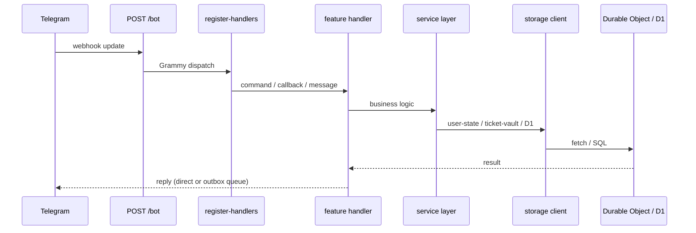
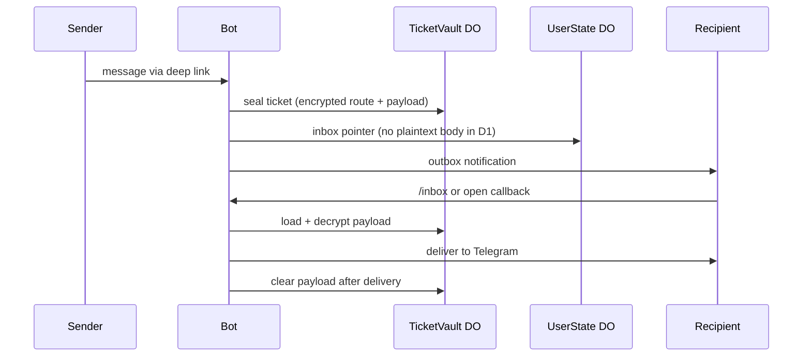

# Developer onboarding

Short map for new contributors. Full operating rules live in [`AGENTS.md`](../AGENTS.md) at the repo root.

## What this project is

Nekonymous is a **single Cloudflare Worker** with a **Telegram webhook only** (`POST /bot`). No public website in V1.

Stack: Grammy bot, D1, KV (routing cache), Durable Objects (per-user state, ticket vault, outbox), Queues, Workers AI + Vectorize for matching.

## Where to start reading

| Question | Start here |
|----------|------------|
| Worker entry, DO exports | `src/index.ts` |
| Bot wiring (commands, callbacks) | `src/bot/register-handlers.ts` |
| Slash commands list | `src/bot/commands.ts` |
| Inbox callback prefixes & callback refs | `src/utils/telegram-callbacks.ts` |
| Assessment callbacks & limits | `src/features/assessment/constants.ts` |
| Matching callbacks & limits | `src/features/matching/constants.ts` |
| Shared domain types (`Environment`, `BotUser`, …) | `src/types.ts` |
| Domain status unions (`InboxPointerStatus`, …) | `src/status.ts` |
| User-facing Persian copy | `src/i18n/` |
| Privacy / threat model | `docs/security/threat-model.md` |
| Messaging architecture | `docs/architecture/messaging.md` |
| Ticketing crypto modules | `src/ticketing/` (see `docs/architecture/crypto.md`) |

## Request flow (webhook)



**Rule of thumb:** handlers → feature services → `src/storage/*-client.ts` → DO/D1. Do not call DOs directly from handlers.

## Anonymous message flow (simplified)



Capabilities for inline buttons (`o:`, `r:`, `b:`, …) are built in `src/utils/telegram-callbacks.ts` and must match the regexes in `register-handlers.ts`.

## Adding a new slash command

1. Implement handler in the right `src/features/*/` file.
2. Register `bot.command(...)` in `src/bot/register-handlers.ts`.
3. Add the command name to `BOT_COMMANDS` in `src/bot/commands.ts` (so unknown-command handling stays correct).

## Adding a new inline callback prefix

1. If inbox-related: extend `InboxCallbackAction` and `INBOX_CALLBACK_PREFIX` in `src/utils/telegram-callbacks.ts`.
2. If feature-specific: follow `ASSESSMENT_CALLBACK` / `MATCH_CALLBACK` pattern in that feature’s `constants.ts`.
3. Register `bot.callbackQuery(...)` in `register-handlers.ts`.
4. Keep `callback_data` under Telegram’s 64-byte limit.

## Types and constants — what goes where

- **`src/types.ts`** — types shared across features or at storage boundaries (`Environment`, `BotUser`, payloads).
- **`src/status.ts`** — domain status unions (`InboxPointerStatus`, `D1UserStatus`, `MatchSuggestionStatus`, …).
- **`src/features/<name>/constants.ts`** — limits, TTLs, callback builders for one feature.
- **`src/features/<name>/*-types.ts`** — D1 row shapes and service DTOs for one feature.
- **`src/storage/*/*.types.ts`** — Durable Object record shapes.

Avoid a single global junk-drawer file; keep constants next to the feature unless two layers need the same contract (like Telegram callbacks).

## Checks before opening a PR

```bash
pnpm check
```

Runs typecheck, lint, knip, ticketing/assessment/matching verification scripts, and ticket-storage audit.

## What not to do

- Store plaintext message bodies or sender–recipient graphs in D1.
- Store raw callback capabilities in D1 or KV.
- Add a parallel `core/` service framework.
- Log ticket ids, keys, or decrypted payloads.

See [`AGENTS.md`](../AGENTS.md) for the full checklist.
